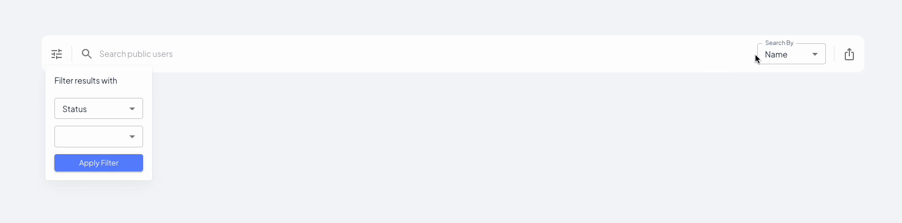

<div>
  <h1>@gimnathperera/react-mui-multi-search</h1>

🎯 Unlock the power of Material-UI version 5 with our sleek React component and npm package! Experience effortless, multi-faceted search and filtering capabilities like never before.



[](https://github.com/your-username/your-project-name/blob/main/LICENSE) [](https://www.npmjs.com/package/@gimnathperera/react-mui-multi-search)

</div>

## Table of contents

- [Features](#features)
- [Installation](#installation)
- [Usage](#usage)
- [API](#api)
- [Accessibility](#Accessibility)
- [Local Development](#local-development)
- [Contributing](#contributing)
- [License](#license)

## Features

Currently, `@gimnathperera/react-mui-multi-search` supports the following:

- [x] Single or multi-search input fields.
- [x] Various filter criteria (e.g., text, date, numeric).
- [x] Add, remove, and clear filters.
- [x] Support for custom filter components.
- [x] Support for Material-UI theming.
- [x] Mobile responsive
- [ ] Dark mode support
- [ ] Support for custom icons

You can suggest new features [here](https://github.com/gimnathperera/react-mui-multi-search/issues)

## Installation

### Package Managers

```bash
# npm
npm i @gimnathperera/react-mui-multi-search
or
# yarn
yarn add @gimnathperera/react-mui-multi-search
or
# pnpm
pnpm i @gimnathperera/react-mui-multi-search
```

## Usage

```ts
import {MultiSearch} from '@gimnathperera/react-mui-multi-search';


<MultiSearch
  placeholder='Search public users'
  searchOptions={[
    { key: 'Name', value: 'name' },
    { key: 'Email', value: 'email' },
  ]}
  filterOptions={[
    {
      filterKey: { key: 'Status', value: 'status' },
      filterOptions: [
        { key: 'Active', value: 'active' },
        { key: 'Inactive', value: 'inactive' },
        { key: 'Pending', value: 'pending' },
      ],
      filterType: 'SELECT',
    },
    {
      filterKey: { key: 'Role', value: 'role' },
      filterOptions: [
        { key: 'Admin', value: 'admin' },
        { key: 'Owner', value: 'owner' },
        { key: 'Visitor', value: 'visitor' },
      ],
      filterType: 'SELECT',
    },

  ]}
  onSearch={(searchText, filters) => {
    console.log(searchText, filters);
  }}
/>
```

### Data

Structure of the data that's taken by the component,

**TS Definition**

```js
interface SelectOption {
  key: string;
  value: string;
}

interface FilterOption {
  key: string;
  value: string;
}

interface Filter {
  filterKey: SelectOption;
  filterOptions: SelectOption[];
  filterType?: 'SELECT' | 'INPUT' | 'DATE' | 'DATE_RANGE';
}
```

## API

### MultiSearch

| Parameter | Description                | Type                     | Default  |
| --------- | -------------------------- | ------------------------ | -------- |
| size      | size of the modal          | `small` `medium` `large` | `medium` |
| styles    | the style of the component | Object                   | {}       |
| hide      | hide the button            | boolean                  | `false`  |

## Local Development

The `main` branch contains the latest version of the @gimnathperera/react-mui-multi-search component.

To begin local development:

1. `yarn install`
2. `yarn run dev`

Storybook will appear on on <http://localhost:6006>

You can run `yarn test` to execute the test suite and linters. To help you develop the component we’ve set up some tests that cover the basic functionality (can be found in `<component>/__tests__`).
To check the test coverage you can run `yarn coverage`.

## Contributing

Contributions are welcome! If you have any ideas, bug reports, or feature requests, please submit them through the GitHub issue tracker. If you would like to contribute code, follow these steps:

1. Fork the repository.
2. Create a new branch for your feature or bug fix.
3. Make the necessary changes and commit them.
4. Push your changes to your forked repository.
5. Submit a pull request to the main repository.

## License

This project is licensed under the 

#

If you need to reach out to me [contact me](mailto:gimnathperera@gmail.com).
